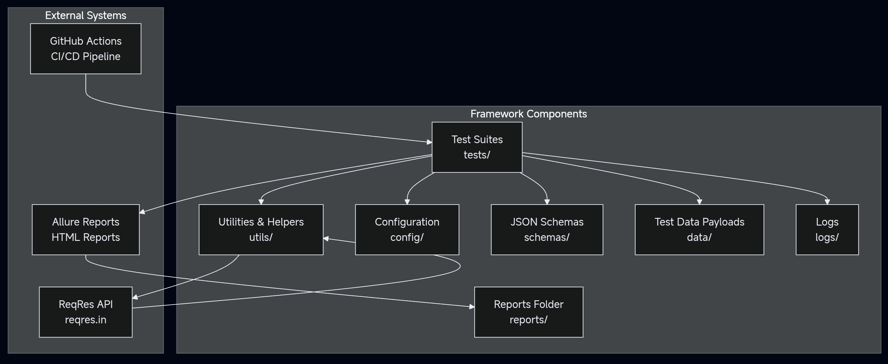

# 🚀 API Test Automation Framework

[](https://github.com/SaahilParmar/API-Test-Automation-Framework/actions/workflows/ci.yml)
[](https://www.python.org/downloads/)
[](https://github.com/psf/black)
[](https://github.com/PyCQA/bandit)
[](https://opensource.org/licenses/MIT)

A professional, enterprise-grade API testing framework built with Python. This framework demonstrates modern testing practices including contract testing, data-driven testing, and comprehensive CI/CD integration.

## 📋 Overview

### Architecture


This diagram shows how different components of the framework interact with each other.

This framework is designed to test the [ReqRes Public API](https://reqres.in/) but can be adapted for any RESTful API. It incorporates:

- **Contract Testing**: JSON Schema validation ensures API responses match specifications
- **Data-Driven Testing**: Parameterized tests with various data sets
- **Security Scanning**: Integrated security checks with Bandit and Safety
- **Performance Validation**: Response time validation and performance test capabilities
- **Comprehensive Reporting**: Allure reports with detailed test analytics

---

## ✅ Features

- Modular and scalable folder structure
- Configurable environments (e.g. dev, staging)
- JSON Schema validation (contract testing)
- Data-driven POST testing
- Boundary and negative test cases
- Retry logic and timeouts
- Allure report integration
- Pytest markers and logging
- Compatible with CI/CD (via GitHub Actions)
- Isolated virtual environment in `.venv`

---

## 🗂️ Project Structure

```bash
API-Test-Automation-Framework/
├── .github/workflows/    # CI/CD pipeline configurations
│   └── ci.yml           # Main workflow file
├── config/              # Environment & test configurations
│   └── config.yaml      # Configuration parameters
├── data/                # Test data files
│   ├── large_payload.json       # Large request payload testing
│   └── post_user_payloads.json # Data-driven test payloads
├── schemas/             # JSON Schema definitions
│   ├── create_user_schema.json  # POST request validation
│   ├── single_user_schema.json  # Single user response
│   └── user_list_schema.json    # User list response
├── tests/              # Test suites
│   ├── test_api_validation.py   # API contract tests
│   ├── test_error_scenarios.py  # Error handling tests
│   ├── test_user_creation.py    # User creation tests
│   └── test_user_retrieval.py   # User retrieval tests
├── utils/              # Utility functions
│   └── api_utils.py    # Common API operations
├── reports/            # Test execution reports
├── conftest.py         # Pytest fixtures & configurations
├── pytest.ini          # Pytest settings & markers
├── requirements.txt    # Project dependencies
└── setup.sh           # Environment setup script
```

---

## ⚙️ Prerequisites

- Python 3.10 or higher
- Git
- Java Runtime Environment (JRE) for Allure reporting
- Bash-compatible shell (Git Bash for Windows users)

## 🛠️ Installation

1. **Clone the Repository**:
   ```bash
   git clone https://github.com/SaahilParmar/API-Test-Automation-Framework.git
   cd API-Test-Automation-Framework
   ```

2. **Create Virtual Environment**:
   ```bash
   # Create .venv in project directory
   python -m venv .venv

   # Activate virtual environment
   # On Unix/macOS:
   source .venv/bin/activate
   # On Windows:
   .venv\Scripts\activate
   ```

3. **Install Dependencies**:
   ```bash
   # Upgrade pip
   python -m pip install --upgrade pip

   # Install project dependencies
   pip install -r requirements.txt
   ```

4. **Install Allure** (Required for reports):
   
   On macOS:
   ```bash
   brew install allure
   ```
   
   On Linux:
   ```bash
   sudo apt-add-repository ppa:qameta/allure
   sudo apt-get update
   sudo apt-get install allure
   ```
   
   On Windows:
   ```bash
   scoop install allure
   ```

📸 Chrome installation step (Linux):


---

---

## 🚀 Quick Start

1. Clone the repository:
   ```bash
   git clone https://github.com/your-username/API-Test-Automation-Framework.git
   cd API-Test-Automation-Framework
   ```

2. Run the setup script (creates `.venv` and installs dependencies):
   ```bash
   ./setup.sh
   ```

3. Activate the virtual environment:
   ```bash
   source .venv/bin/activate  # On Unix/macOS
   # or
   .venv\Scripts\activate     # On Windows
   ```

4. Run the tests:
   ```bash
   pytest tests/ -v          # Run all tests
   pytest tests/ -m smoke    # Run smoke tests only
   ```

⚠️ Important: Always use the `.venv` virtual environment. This is the standard environment used by our CI/CD workflow and ensures consistent test execution across all environments.

## 🛠️ Development Setup

1. Ensure you're using the correct virtual environment:
   ```bash
   # You should see (.venv) in your prompt
   # If not, activate it:
   source .venv/bin/activate
   ```

2. Verify your setup:
   ```bash
   python --version  # Should match version in .github/workflows/ci.yml
   pip list         # Should match requirements.txt
   ```

3. Install new dependencies:
   ```bash
   pip install new-package
   pip freeze > requirements.txt  # Update requirements
   ```

## 🧪 Running Tests

1. **Run All Tests**:
   ```bash
   pytest tests/ -v
   ```

2. **Run Specific Test Types**:
   ```bash
   pytest tests/ -m smoke        # Smoke tests only
   pytest tests/ -m "not slow"   # Skip slow tests
   ```

3. **Run Tests in Parallel**:
   ```bash
   pytest tests/ -n auto
   ```

4. **Generate Coverage Report**:
   ```bash
   pytest tests/ --cov=utils --cov-report=html
   ```

## 📊 Generating Reports

1. **Generate Allure Report**:
   ```bash
   # Run tests with Allure
   pytest tests/ --alluredir=allure-results

   # Generate HTML report
   allure generate allure-results -o allure-report --clean
   ```

2. **View Report**:
   ```bash
   allure serve allure-results
   ```

   The report will automatically open in your default browser.

## 📊 Test Execution & Reports

### Successful Test Run

*Example of a successful test execution showing all test categories passing*

### Allure Report Dashboard

*Comprehensive test results with trends, behaviors, and detailed test cases*

### Code Coverage

*HTML coverage report showing test coverage across the codebase*

## 🔍 Test Categories

- **API Validation** (`test_api_validation.py`):
  - Contract testing with JSON schemas
  - Response headers validation
  - Response time validation

- **Error Scenarios** (`test_error_scenarios.py`):
  - 404 Not Found handling
  - Invalid request handling
  - Malformed data testing

- **User Operations** (`test_user_*.py`):
  - CRUD operations testing
  - Data-driven testing
  - Edge cases

## 👥 Contributing

1. Create a new branch:
   ```bash
   git checkout -b feature/your-feature-name
   ```

2. Run pre-commit checks:
   ```bash
   pre-commit run --all-files
   ```

3. Run tests before committing:
   ```bash
   pytest tests/ -v
   ```

## 🔐 Security

The framework includes several security measures:
- Automated security scanning with Bandit
- Dependency vulnerability checking with Safety
- Pre-commit hooks for security checks
- Regular security updates via GitHub Actions

## 📚 Documentation

Detailed test documentation is available at:
https://saahilparmar.github.io/API-Test-Automation-Framework/

The documentation is automatically updated on each successful merge to main.

## ⚠️ Common Issues & Solutions

1. **Virtual Environment Issues**:
   ```bash
   # If .venv is not working:
   rm -rf .venv
   python -m venv .venv
   source .venv/bin/activate
   ```

2. **Allure Report Generation Fails**:
   ```bash
   # Check Java installation:
   java -version
   
   # Reinstall Allure if needed:
   npm install -g allure-commandline
   ```

3. **Test Failures**:
   - Ensure you're using Python 3.10+
   - Verify all dependencies are installed
   - Check API availability at https://reqres.in/

## 🤝 Support

For issues and feature requests, please use the GitHub Issues tracker.

## 📄 License

This project is licensed under the MIT License - see the [LICENSE](LICENSE) file for details.
