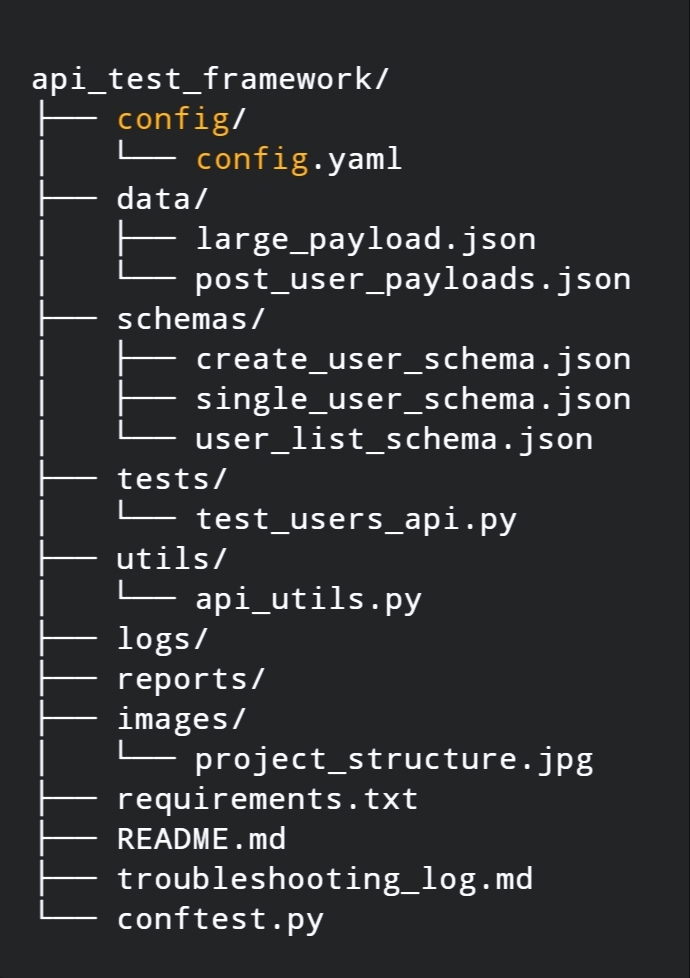

`# 🧪 API Test Automation Framework

A professional API testing framework built using **Python**, **Pytest**, and **Allure** for reporting.  
This framework is designed to test RESTful APIs using data-driven and contract-based testing approaches.  
Target API: [ReqRes Public API](https://reqres.in/)

---

## ✅ Features

- Modular and scalable folder structure
- Configurable environments (e.g. dev, staging)
- JSON Schema validation (contract testing)
- Data-driven POST testing
- Boundary and negative test cases
- Retry logic and timeouts
- Allure report integration
- Pytest markers and logging
- Compatible with CI/CD (via GitHub Actions)

---

## 🗂️ Project Structure

```
api_test_framework/
├── config/
│   └── config.yaml
├── data/
│   ├── large_payload.json
│   └── post_user_payloads.json
├── schemas/
│   ├── create_user_schema.json
│   ├── single_user_schema.json
│   └── user_list_schema.json
├── tests/
│   ├── test_user_retrieval.py      # GET operations & user listing
│   ├── test_user_creation.py       # POST operations & user creation
│   ├── test_error_scenarios.py     # 404, invalid requests, edge cases
│   ├── test_api_validation.py      # Schema validation & headers
├── utils/
│   └── api_utils.py
├── logs/
├── reports/
├── requirements.txt
├── pytest.ini                     # Test configuration & markers
├── test_runner.sh                 # Test execution script
├── setup.sh                      # Automated setup script
├── README.md
├── troubleshooting_log.md
└── conftest.py
```

📸 *Screenshot of project structure:*  



---

## ⚙️ Installation & Setup

### Quick Setup (Recommended)
```bash
# Clone this repo
git clone https://github.com/YOUR-USERNAME/api_test_automation_framework.git
cd api_test_automation_framework

# Run the setup script (creates venv and installs dependencies)
./setup.sh
```

### Manual Setup
```bash
# Clone this repo
git clone https://github.com/YOUR-USERNAME/api_test_automation_framework.git
cd api_test_automation_framework

# Create virtual environment
python3 -m venv venv
source venv/bin/activate

# Install dependencies
pip install -r requirements.txt
```

📸 Chrome installation step (Linux):


---

---

## 🧪 Running Tests

### Quick Start
```bash
# Run all tests
./test_runner.sh all

# Run smoke tests (quick validation)
./test_runner.sh smoke

# Run specific test categories
./test_runner.sh regression
./test_runner.sh negative
```

### Test Categories Available

| Category | Description | Command |
|----------|-------------|---------|
| 🚀 **smoke** | Core functionality validation | `./test_runner.sh smoke` |
| 🔄 **regression** | Comprehensive testing | `./test_runner.sh regression` |
| ❌ **negative** | Error scenarios & edge cases | `./test_runner.sh negative` |
| 🔍 **boundary** | Boundary testing (large payloads) | `./test_runner.sh boundary` |
| 📋 **contract** | API schema validation | `./test_runner.sh contract` |
| ⚡ **performance** | Response time validation | `./test_runner.sh performance` |
| � **retrieval** | User GET operations | `./test_runner.sh retrieval` |
| ➕ **creation** | User POST operations | `./test_runner.sh creation` |

### Direct pytest Commands
```bash
# Run specific test file
pytest tests/test_user_retrieval.py -v

# Run tests with specific markers
pytest -m "smoke" -v
pytest -m "user_creation and not boundary" -v

# Run all tests with detailed output
pytest -v --tb=short
```


---

---

## 📊 Generate Allure Report

```bash
# Generate and view HTML report
allure generate reports/allure-results -o reports/html --clean
allure open reports/html

# Or serve live report
allure serve reports/allure-results
```

---

## 🚦 Test Organization

### Test Modules

| Module | Purpose | Key Features |
|--------|---------|--------------|
| `test_user_retrieval.py` | GET operations | User listing, single user, pagination |
| `test_user_creation.py` | POST operations | Data-driven creation, boundary testing |
| `test_error_scenarios.py` | Error handling | 404s, invalid data, malformed requests |
| `test_api_validation.py` | Contract testing | Schema validation, headers, performance |

### Pytest Markers

The framework uses comprehensive pytest markers for test categorization:

```bash
# Execution-based markers
@pytest.mark.smoke          # Quick validation tests
@pytest.mark.regression      # Comprehensive test suite
@pytest.mark.negative        # Error scenario tests
@pytest.mark.boundary        # Edge case and boundary tests

# Feature-based markers  
@pytest.mark.user_retrieval  # GET user operations
@pytest.mark.user_creation   # POST user operations
@pytest.mark.error_scenarios # Error handling tests
@pytest.mark.api_validation  # Contract and validation tests

# Quality markers
@pytest.mark.contract        # API schema validation
@pytest.mark.performance     # Response time validation
```

### Running Specific Test Categories
```bash
# Run only smoke tests
pytest -m smoke

# Run user creation tests
pytest -m user_creation

# Combine markers
pytest -m "smoke and user_retrieval"

# Exclude certain tests
pytest -m "not boundary"
```


---

🛠 Troubleshooting

See troubleshooting_log.md for common errors and fixes (e.g., Chrome driver, Allure, virtualenv).


---

🤝 Contributing

Pull requests are welcome. Please open an issue first to discuss changes.


---

📄 License

This project is licensed under the MIT License.
