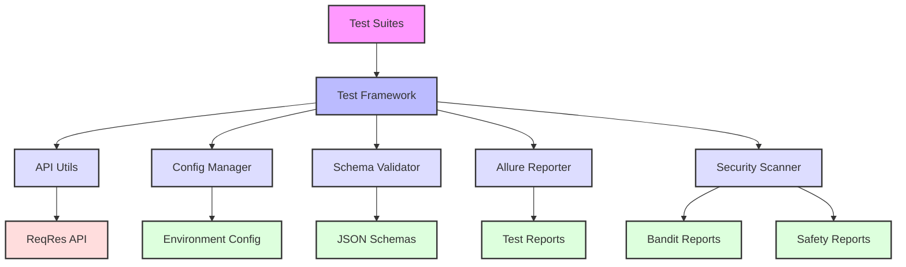

```mermaid
graph TD
    A[Test Suites] --> B[Test Framework]
    B --> C[API Utils]
    B --> D[Config Manager]
    B --> E[Schema Validator]
    C --> F[ReqRes API]
    D --> G[Environment Config]
    E --> H[JSON Schemas]
    B --> I[Allure Reporter]
    I --> J[Test Reports]
    B --> K[Security Scanner]
    K --> L[Bandit Reports]
    K --> M[Safety Reports]
    
    style A fill:#f9f,stroke:#333,stroke-width:2px
    style B fill:#bbf,stroke:#333,stroke-width:2px
    style C fill:#ddf,stroke:#333,stroke-width:2px
    style D fill:#ddf,stroke:#333,stroke-width:2px
    style E fill:#ddf,stroke:#333,stroke-width:2px
    style F fill:#fdd,stroke:#333,stroke-width:2px
    style G fill:#dfd,stroke:#333,stroke-width:2px
    style H fill:#dfd,stroke:#333,stroke-width:2px
    style I fill:#ddf,stroke:#333,stroke-width:2px
    style J fill:#dfd,stroke:#333,stroke-width:2px
    style K fill:#ddf,stroke:#333,stroke-width:2px
    style L fill:#dfd,stroke:#333,stroke-width:2px
    style M fill:#dfd,stroke:#333,stroke-width:2px
```
